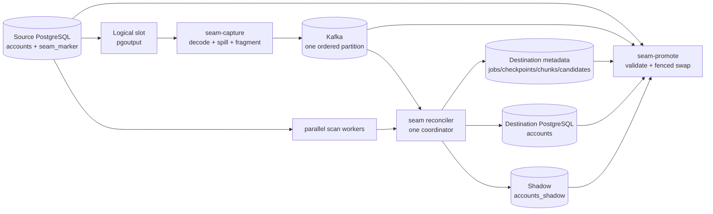

# SEAM engineering deep dive and interview defense guide

This document explains the code that exists in this working tree. It is written as a learning guide for someone who knows the basic idea of SEAM but needs to defend its design in front of an experienced CDC, PostgreSQL, or distributed-systems engineer.

The working tree is currently **uncommitted**. That matters: this report describes the files on disk, including the large uncommitted implementation, rather than the last Git commit. The evidence boundary is also deliberate. Where a property is proved by code and tests, the report says so. Where it is an operating assumption or an unmeasured limit, the report says that instead.

### How to study this report

Do not try to memorize all 29 sections in one pass.

1. **First pass — understand the system:** read sections 1–7. You should be able to draw the architecture and explain the stale-update and delete-resurrection races without looking.
2. **Second pass — understand failure handling:** read sections 8–15 and trace one source transaction, one chunk, one crash, and one promotion through the persistent tables.
3. **Third pass — defend the evidence:** read sections 18–25. Practice answering each interview question by giving the invariant, a concrete failing event sequence, the enforcing code, the test, and the cost.
4. **Before presenting it:** read sections 20, 28, and 29 again. State the limits before an interviewer has to discover them.
   
Keep this five-part answer pattern for technical questions:

```text
Problem -> invariant -> mechanism -> failure test -> tradeoff/limit
```

For example: “A snapshot can resurrect a concurrent delete. The invariant is that a key touched between LOW and HIGH cannot be written as a snapshot survivor. The coordinator durably evicts it and commits survivors with HIGH. The delete-resurrection and crash tests exercise this. The cost is marker latency and candidate staging.”

---

## 1. The thirty-second explanation

SEAM is a deliberately narrow PostgreSQL-to-PostgreSQL replication system for one fixed table:

```sql
public.accounts(
    id BIGINT PRIMARY KEY,
    owner TEXT NOT NULL,
    balance_cents BIGINT NOT NULL
)
```

It combines two data paths:

1. **A snapshot/backfill path** reads existing rows from PostgreSQL in parallel primary-key ranges.
2. **A CDC path** reads committed PostgreSQL transactions from logical replication, puts them on one ordered Kafka partition, and applies them to the destination.

The hard part is not copying rows. The hard part is combining a moving snapshot with live changes without resurrecting deletes, overwriting new values with stale snapshot values, exposing half a source transaction, losing work after a crash, or allowing an expired process to keep writing.

SEAM solves that race with LOW and HIGH markers written into the same source database and observed in the same CDC stream as account changes. A chunk scan happens between those two markers. Any key changed while the chunk window is open is evicted from that chunk's snapshot candidates. The coordinator commits the surviving candidates before it advances past HIGH. The destination transaction also records the source transaction, chunk completion, and Kafka checkpoint atomically.

For online resync, SEAM builds `accounts_shadow` while the existing `accounts` remains queryable and continues receiving CDC. Promotion uses two short source write fences, an exact Kafka-prefix gate, a full comparison against an MVCC source snapshot while writes are allowed again, a bounded changed-key comparison under the final fence, and a PostgreSQL transactional rename. The old live table is retained.

That makes SEAM much more than a copy script, but it is not a general connector and it is not an Artie-scale product. Its strongest value is the explicit correctness machinery, failure tests, and honest performance boundary.

---

## 2. The real problem SEAM is solving

Imagine the source begins with this row:

```text
id=42, owner=Ada, balance=100
```

A naive backfill does the following:

1. read row 42 from the source;
2. before writing it to the destination, CDC receives an update setting the balance to 200;
3. CDC writes 200 to the destination;
4. the delayed snapshot writes its stale value 100.

The final destination is wrong even though neither write failed. This is the **stale snapshot overwrite** race.

A delete is worse:

1. the snapshot reads row 42;
2. the source deletes row 42;
3. CDC deletes it at the destination;
4. the snapshot later inserts its old copy.

The backfill has **resurrected a deleted row**.

Stopping source writes avoids these races, but large backfills can take hours or days. A system intended for online operation must merge snapshot rows and CDC while source writes continue. It must also survive retries and process failures, preserve source transaction boundaries, and know exactly which history is still available.

SEAM's core question is therefore:

> How can a process read historical rows in parallel while another ordered path applies live transactions, and still produce a destination corresponding to a valid source prefix after arbitrary process crashes?

The fixed schema is a strength for this stage of the project. It removes connector breadth and leaves room to make transactionality, fencing, recovery, cutover, and performance measurable. The fixed schema is also a hard product limitation; it must never be presented as generic CDC.

---

## 3. Scope and exact guarantee

### 3.1 Supported contract

The current implementation supports:

- PostgreSQL `public.accounts` as the source;
- PostgreSQL `public.accounts` or `public.accounts_shadow` as the destination;
- `id BIGINT` as the immutable primary key;
- `owner TEXT NOT NULL` and `balance_cents BIGINT NOT NULL`;
- insert, update, and delete;
- one PostgreSQL logical-replication publication containing `accounts` and `seam_marker`;
- one logical slot owned by one capture process at a time;
- one Kafka topic with exactly one partition;
- one active reconciler process per job, with several chunk workers inside it;
- an initial backfill or an online shadow resync;
- PostgreSQL-to-PostgreSQL atomic promotion for the exact destination-table contract.

### 3.2 The useful correctness statement

Under the supported schema and operation set, while the source slot and Kafka history remain recoverable, with no arbitrary destination writers and no unsupported DDL, SEAM aims to maintain these properties:

1. A committed source transaction is never intentionally exposed as a partial destination transaction.
2. A snapshot candidate changed during its LOW/HIGH window cannot overwrite the corresponding live value or resurrect a delete.
3. A durable Kafka checkpoint advances in the same destination transaction as the effects represented by that checkpoint.
4. A source transaction replay can be recognized by source commit LSN even when Kafka republishes it at a different offset.
5. An expired reconciler, worker lease, or capture owner cannot legitimately continue durable work using stale ownership.
6. Completed chunk ranges form a contiguous logical prefix, even when actual source keys are sparse.
7. Promotion swaps the shadow table only after it has been compared with the source at an exact stream boundary and revalidated for the suffix that changed before final cutover.

This is often described informally as “exactly once,” but that phrase hides too much. A more accurate description is:

- capture is **at least once** across PostgreSQL-to-Kafka failure boundaries;
- source transactions carry a stable LSN identity;
- destination application is atomic and replay-deduplicated by LSN;
- checkpoints are transactionally coupled to destination writes;
- the resulting behavior is effectively once for the supported destination effects.

This does not claim a distributed transaction between PostgreSQL and Kafka. There is none.

### 3.3 Explicitly unsupported

The implementation fails closed for:

- `TRUNCATE`;
- primary-key changes;
- source or destination schema drift;
- unexpected relations, column order, or PostgreSQL type OIDs;
- binary pgoutput tuple values;
- unsupported pgoutput message types;
- multiple Kafka partitions;
- arbitrary source tables or composite/non-BIGINT keys;
- arbitrary destination indexes, constraints, triggers, row-level security, partitioning, or views in the promotion path;
- arbitrary writers modifying destination rows outside SEAM;
- automatic DDL replication;
- automatic rollback to the retained table after promotion.

Failing closed is part of correctness. Silently skipping an unknown logical-replication message would allow the checkpoint to pass history the destination did not understand.

### 3.4 Current subsystem assessment

These labels evaluate the implementation for its stated fixed-schema scope. “Correctly implemented” means the design, code, and available tests agree on the invariant; it does not mean formal verification or production history.

| Subsystem | Assessment | Evidence and qualification |
| --- | --- | --- |
| Fixed `accounts` pgoutput decoding | **Correctly implemented for scope** | Exact relation/type checks, insert/update/delete, unchanged TOAST reconstruction, and fail-closed tests exist. General schemas are missing by design. |
| Transaction framing | **Correctly implemented for scope** | Small transactions remain whole; large transactions spill, fragment, reassemble, and apply in one destination transaction. Unit and live integration tests cover acknowledgement and atomicity. |
| PostgreSQL-to-Kafka handoff | **Partially implemented as a production service** | Replay safety and capture fencing exist. Broker HA, multi-partition scaling, operational retention automation, and cross-region behavior are outside the fixture. |
| Source/capture identity | **Correctly implemented for scope** | Source system ID, topic ID, advisory ownership, and capture epoch are checked. Generation rollover is not exposed as a full lifecycle. |
| Fresh-job boundary | **Correctly implemented for scope** | A unique source barrier is observed in Kafka before job creation; source and broker identities are persisted. |
| Durable chunk discovery | **Correctly implemented for scope** | Cursor + chunk insertion are atomic, manifests seal, sparse gaps and `MinInt64` are tested, and interrupted discovery resumes. |
| LOW/HIGH reconciliation | **Correctly implemented for scope** | Concurrent update/delete/insert races, duplicate markers, ordering, and crash points are tested. It is tied to one ordered stream and one immutable BIGINT key. |
| Parallel scan coordination | **Correctly implemented for current workloads** | One coordinator preserves CDC order while workers scan; out-of-order completion tests exist. Manifest memory and destination staging have not been proved at large scale. |
| Memory bounding | **Partially implemented** | Transaction payloads spill to disk, Kafka fragments are disk-backed, candidate rows are durably staged, and row/byte caps exist. A scan still creates a bounded in-process slice and aborts when its configured bound is exceeded; complete manifest memory scales with chunk count. |
| Destination atomicity/dedupe | **Correctly implemented for PostgreSQL** | Data effects, applied LSN, chunk completion, and checkpoint share a destination transaction. No equivalent abstraction exists for non-transactional/warehouse sinks. |
| Reconciler and worker fencing | **Correctly implemented for scope** | Owner epochs, database-time expiry, assertions inside writes, lease tokens, and takeover tests exist. |
| Crash recovery | **Correctly implemented for the supported retained-history cases** | New attempts fence old candidates/work; failpoints and chaos tests exercise replay. Missing Kafka/WAL history deliberately requires resnapshot. |
| Resource admission | **Correctly implemented, operationally fragile** | Local and process-shared scan/transaction limits plus CDC-lag throttling exist. All processes must be configured with the same limits, and fairness/autotuning is not provided. |
| Online live/shadow resync | **Correctly implemented for the narrow PostgreSQL contract** | Both jobs run concurrently and live integration passes. It doubles much of the destination work and has limited scale evidence. |
| Exact-prefix promotion | **Correctly implemented for the narrow PostgreSQL contract** | Two source fences, MVCC validation, changed-key suffix validation, route fencing, transactional rename, ambiguous-commit recovery, and idempotent retry exist. Schema/dependency support is intentionally restrictive. |
| Verification | **Correctly implemented but expensive** | Exact ordered comparison exists. The simple fenced verifier blocks source writes for O(N); promotion has a more sophisticated two-fence version. |
| Configuration validation | **Correctly implemented for exposed settings** | Malformed and unsafe values fail fast, with unit/CLI tests. Cluster-wide configuration agreement is not persisted. |
| Metrics and health | **Partially implemented** | Basic counters, checkpoint progress, and liveness endpoints exist. Freshness SLOs, alerts, tracing, latency histograms, and slot/disk monitoring are missing. |
| Metadata evolution | **Fragile** | `EnsureTables` uses additive `CREATE/ALTER IF NOT EXISTS`. There is no numbered migration framework or downgrade/compatibility policy. |
| Generic schemas and connectors | **Missing** | The implementation is intentionally fixed to PostgreSQL `accounts`. |
| DDL/schema evolution | **Missing** | Drift is detected and rejected; it is not replicated. |
| Large-scale proof | **Missing** | Exact-verified tests reach 100,000 rows locally. There is no 1M/10M/100M distribution, sustained-write benchmark, or production incident history. |
| High-availability deployment | **Missing** | The bundled broker is single-replica development infrastructure; deployment automation, TLS/secrets, multi-AZ failure, backup, and restore are not a finished system. |

---

## 4. Terminology you must be able to distinguish

Several identifiers exist because they fence different failure domains. They are not interchangeable.

| Term | Meaning | Why it exists |
| --- | --- | --- |
| **source system ID** | PostgreSQL cluster identity from `pg_control_system()` | Detects replacement of the source cluster even when the hostname and database name are unchanged. |
| **generation** | Logical replication generation, currently `gen:0` in the production path | Names one logical history lineage. The data model allows generation scoping, although generation rollover is not a finished feature. |
| **source XID** | PostgreSQL transaction ID | Useful diagnostics, but it can wrap and is not the durable dedupe key. |
| **source commit LSN** | WAL location associated with a committed source transaction | Stable identity across Kafka republish; used by `seam_applied_txs`. |
| **Kafka offset** | Position of an envelope/fragment in the single topic partition | Orders transport records. The checkpoint stores the next offset to consume. It is not a stable source-transaction identity. |
| **attempt** | Recovery incarnation such as `gen:0:attempt:3` | Separates chunk work and candidates from a previous crashed run. |
| **reconciler owner epoch** | Monotonically increasing epoch for the process owning one job | Fences an old whole reconciler after leadership takeover. |
| **chunk lease token** | Monotonically increasing token for one leased range | Fences a stale worker even inside the current attempt and owner. |
| **capture owner epoch** | Monotonic epoch for the process owning a source slot | Fences a second or resumed capture process. |
| **route-fence epoch** | Destination routing generation changed during promotion | Serializes ordinary SEAM writers with table-name swap. |
| **LOW/HIGH marker IDs** | Unique source rows surrounding a chunk scan | Establish the CDC interval during which snapshot candidates must be invalidated. |
| **barrier marker** | Unique source control row used to find an exact stream prefix | Used for job start, verification, and promotion. |

An interview question may deliberately mix these up. The answer is that each one protects a different boundary: cluster identity, source transaction identity, transport order, process ownership, unit-of-work ownership, or destination routing.

---

## 5. Architecture



There are four executable roles:

| Executable | Responsibility | Important files |
| --- | --- | --- |
| `seam-capture` | Own logical slot, decode WAL, publish complete source transactions or bounded fragments | [`cmd/seam-capture/main.go`](../cmd/seam-capture/main.go), [`internal/capture/reader.go`](../internal/capture/reader.go), [`internal/capture/decoder.go`](../internal/capture/decoder.go), [`internal/capture/leadership.go`](../internal/capture/leadership.go) |
| `seam` | Create/recover a job, own its destination checkpoint, discover chunks, scan in parallel, reconcile CDC | [`cmd/seam/main.go`](../cmd/seam/main.go), [`internal/reconcile/parallel.go`](../internal/reconcile/parallel.go), [`internal/reconcile/stream.go`](../internal/reconcile/stream.go), [`internal/checkpoint/checkpoint.go`](../internal/checkpoint/checkpoint.go) |
| `seam-promote` | Validate and atomically replace live `accounts` with `accounts_shadow` | [`cmd/seam-promote/main.go`](../cmd/seam-promote/main.go), [`internal/promotion/promote.go`](../internal/promotion/promote.go) |
| `seam-lab` | Seed/change demo data and perform moving or fenced verification | [`cmd/seam-lab/main.go`](../cmd/seam-lab/main.go), [`cmd/seam-lab/verify_fenced.go`](../cmd/seam-lab/verify_fenced.go) |

Kafka is an ordered handoff log. PostgreSQL is the durable control plane for jobs, ownership, chunk state, candidates, checkpointing, and promotion. The source database is also used for ordering markers relative to real changes.

---

## 6. End-to-end lifecycle

### 6.1 Capture starts first

`seam-capture` validates configuration, connects to PostgreSQL in replication mode and SQL mode, checks or creates the logical slot, verifies the publication, verifies `REPLICA IDENTITY FULL`, reads the PostgreSQL system ID, and validates a one-partition Kafka topic. It pins the topic's identity, not just its name.

It then acquires source-side ownership for the slot. The ownership mechanism combines:

- a PostgreSQL session advisory lock, which disappears when the owning database session dies;
- a `seam_capture_owners` row with an increasing epoch and pinned source/publication/topic identity;
- an assertion before publish/ack progress so a stale owner cannot continue after losing authority.

The main path is in `capture.StartReader` and `acquireCaptureLeadership`.

### 6.2 A fresh job establishes its start boundary

`seam --start-fresh` does not simply read Kafka's current end and start scanning. That would race with changes crossing the source/broker boundary.

Instead it:

1. validates that the destination table has the exact supported shape and is empty;
2. validates slot, publication, source system ID, and Kafka topic identity;
3. reads the current broker end;
4. inserts a unique barrier row into `seam_marker` on the source;
5. waits for that exact marker transaction to appear in Kafka;
6. records the offset immediately after the complete marker transaction as the job start;
7. reads the source maximum `id` as `scan_upper_bound`;
8. creates the durable job and checkpoint;
9. acquires reconciler leadership;
10. discovers and seals the durable chunk manifest.

The barrier matters because it proves capture has crossed a known source commit. The upper bound divides work:

- IDs at or below the upper bound are covered by snapshot ranges plus CDC reconciliation.
- rows inserted above the upper bound do not need to enter the historical scan; CDC delivers them.

The destination is queryable during initial loading, but it is incomplete until the scan frontier reaches the upper bound and CDC catches up. “Queryable” does not mean “complete.”

### 6.3 Durable discovery creates logical ranges

Chunk discovery uses keyset pagination, not `OFFSET`. It asks for the next page of primary keys after the persisted discovery cursor, bounded by `scan_upper_bound`. In the same destination transaction, it inserts the new `seam_chunks` row and advances the cursor.

The ranges are **logical coverage ranges**, not merely min/max of densely existing rows. If source keys are 1, 2, 1000, then the manifest must cover the gap too. A row inserted later at 500 must be classified as belonging to a range whose reconciliation window can observe it.

The first cursor is nullable, which is required to support the legitimate key `math.MinInt64`. A magic numeric sentinel would make that key unrepresentable.

At the end, discovery marks the manifest sealed in a transaction. Recovery can resume from `discovery_cursor`; it cannot incorrectly assume a partially written manifest is complete.

Relevant code:

- `scan.NextChunkFrom` and the keyset queries in [`internal/scan/scan.go`](../internal/scan/scan.go)
- `Store.DiscoverAndCreateChunksForOwned` and manifest validation in [`internal/checkpoint/checkpoint.go`](../internal/checkpoint/checkpoint.go)
- sparse/minimum-key tests in [`internal/checkpoint/discovery_test.go`](../internal/checkpoint/discovery_test.go)

### 6.4 Workers open reconciliation windows

For each range `[min,max]`, a worker:

1. obtains a durable lease with a new lease token;
2. writes a unique LOW marker to the source;
3. reads source rows in `[min,max]` after the LOW transaction has committed;
4. stages those rows in `seam_candidates`;
5. writes a unique HIGH marker;
6. waits for the coordinator to observe the markers and commit the range.

The window is registered with the coordinator before LOW is written, so the
coordinator cannot miss a fast marker. The worker does not need to wait for
Kafka observation before scanning: the committed LOW transaction already
precedes the scan at the source, and Kafka/capture preserve that source commit
order. The coordinator may observe LOW later, but it will still process it
before every later source transaction in the window.

The worker renews its lease while a scan is running. Every chunk mutation checks the current job owner, attempt, worker ID, and lease token. A worker holding old in-memory state cannot finish after its token has been superseded.

### 6.5 The coordinator owns order

Several workers may scan in parallel, but there is one Kafka coordinator. This is a deliberate separation:

- scans are independent and parallelizable;
- CDC has one total source order and must advance one monotonic checkpoint;
- chunk completion must advance a contiguous range prefix.

The coordinator tracks every open window. For each account change, it applies the live mutation and marks that key evicted in every matching open range. When it sees HIGH, it cannot simply continue. It waits until the worker has durably staged the candidates, then commits the eligible survivors with the HIGH source transaction.

If a higher range scans and reaches HIGH before a lower range, it may be ready, but the public `completed_through_id` frontier cannot jump over the lower range. Completion is committed in manifest order.

`runParallelWorkers`, `coord.processStreamTransaction`, and `coord.tryCommit` in [`internal/reconcile/parallel.go`](../internal/reconcile/parallel.go) implement this policy. The marker and streaming transaction handling is in [`internal/reconcile/stream.go`](../internal/reconcile/stream.go).

### 6.6 Completion is one destination transaction

The important chunk-completion transaction contains all of these effects:

- apply account changes from the relevant source transaction;
- record evictions for any open windows;
- write non-evicted staged snapshot candidates;
- record the source LSN in `seam_applied_txs`;
- mark the chunk completed;
- advance `completed_through_id` if the contiguous prefix grew;
- advance `next_kafka_offset` and `last_applied_lsn`.

If PostgreSQL commits, all of them become visible. If it rolls back, none do. A crash after the network connection disappears may leave the caller uncertain about commit success, but replay is safe: the destination can inspect durable checkpoint/applied state and the writes are idempotent.

### 6.7 After scan completion, CDC continues

When all ranges are complete, the reconciler becomes a CDC applier. It continues to consume complete source transactions and advance its checkpoint. The backfill is not a one-shot copier; the same job remains the destination writer.

---

## 7. Why the LOW/HIGH algorithm works

For a range `R`, define:

- `L`: the LOW marker's position in the ordered CDC stream;
- `S`: the source scan that returns candidate rows;
- `H`: the HIGH marker's position;
- `C`: the atomic destination commit of surviving candidates and CDC through `H`.

The worker ensures `L < S < H` in source commit/read ordering: it registers the window, commits LOW, performs the scan/staging, and only then commits HIGH. It does not wait for the consumer to observe LOW before the scan; ordered capture guarantees that LOW will be observed before subsequent source transactions.

For any key in the range:

| Change timing | What happens | Why final state is safe |
| --- | --- | --- |
| before LOW | CDC is applied before the window; the scan sees the resulting committed source state | snapshot and stream agree on the newer state |
| after LOW but before the scan reads the key | CDC marks the key evicted; scan may see old or new value | candidate is not allowed to overwrite live state |
| after the scan reads the key but before HIGH | CDC marks the key evicted | stale candidate is removed; delete cannot be resurrected |
| in the HIGH transaction boundary | marker and any same-transaction changes are processed atomically | complete source transaction semantics are preserved |
| after HIGH | coordinator first commits the range at HIGH, then applies later transactions | later CDC wins in source order |

Eviction is deliberately conservative. A key can be evicted even when the scan happened to read its newest value. That may cause an unnecessary snapshot write to be skipped, but CDC already supplies the authoritative value. Correctness is more important than avoiding one extra eviction.

The tempting alternatives fail:

- **Use timestamps:** clocks do not define source transaction order and can skew.
- **Scan then start CDC:** history between the snapshot and CDC start is lost.
- **Start CDC then blindly upsert the snapshot:** stale values and deletes are overwritten/resurrected.
- **Let each worker consume Kafka independently:** windows see inconsistent subsets and checkpoint order fragments.
- **Commit candidates as soon as the scan returns:** changes before HIGH can still arrive and invalidate them.
- **Track only updates, not deletes/inserts:** delete resurrection and inserts into sparse gaps remain.

---

## 8. Source capture and transaction framing

### 8.1 Decoder contract

[`internal/capture/decoder.go`](../internal/capture/decoder.go) parses `pgoutput` messages and accepts only the two expected relations: `public.accounts` and `public.seam_marker`. It validates relation names, column order, and type OIDs. It rejects `TRUNCATE`, key updates, binary values, and unknown messages.

The source uses `REPLICA IDENTITY FULL`. PostgreSQL may encode an unchanged TOASTed column as “unchanged” rather than resending its large value. SEAM reconstructs that value from the full old tuple. If the required old tuple is absent, it stops instead of publishing an invented or incomplete row.

Requiring full replica identity increases WAL volume because updates carry a complete old row. For a generic system, replica identity and unchanged-TOAST handling would need a more flexible per-table design. Here the cost buys a clear fixed-schema guarantee.

### 8.2 Complete source transactions

CDC correctness is transaction-level, not row-level. If a source transaction updates 10,000 accounts and the destination commits 5,000, readers can see a state that never committed on the source.

`TransactionEnvelope` in [`internal/model/model.go`](../internal/model/model.go) therefore carries source identity and transaction boundaries. A small transaction is one versioned envelope. A large one becomes version-2 fragments with:

- the same `SourceTx` on every fragment;
- contiguous `FragmentIndex` values starting at zero;
- `Final=true` only on the final fragment;
- per-fragment `Count` and whole-transaction `TotalCount` consistency.

### 8.3 Bounded capture memory

An open source transaction is initially buffered in memory. Above the decoder's approximately 800 KiB spill threshold, changes move to a private temporary file. There is also a hard event count (`SEAM_MAX_TX_EVENTS`, default 1,000,000). Crossing the byte threshold spills; crossing the event cap fails. These controls solve different problems:

- spill prevents ordinary large transactions from consuming unbounded RAM;
- the hard event cap refuses a pathological transaction that could consume unreasonable disk/time.

On commit, capture iterates the transaction and publishes fragments kept below roughly 900 KiB. PostgreSQL WAL feedback advances only after Kafka synchronously acknowledges every fragment including the final one.

### 8.4 Failure between PostgreSQL and Kafka

There is no atomic commit spanning the source and Kafka. Consider:

1. Kafka acknowledges a fragment or whole transaction;
2. capture crashes before acknowledging the corresponding WAL LSN to PostgreSQL;
3. logical replication sends the source transaction again;
4. capture publishes it again at new Kafka offsets.

This is expected at-least-once behavior. The source commit LSN remains the same, so destination dedupe uses `(job_id, generation, source_lsn)`. Kafka offset cannot do this because the duplicate has a different Kafka offset.

For fragmented transactions, a crash may leave an abandoned prefix in Kafka. When replay begins with fragment 0 for the same logical transaction, the consumer replaces the incomplete assembly. It never exposes the abandoned prefix as a transaction.

### 8.5 Shutdown correctness

Capture shutdown can race with a publish. [`internal/capture/reader.go`](../internal/capture/reader.go) treats `runCtx.Err()` or caller context cancellation as orderly shutdown even if closing the Kafka client makes the in-flight publish return “client closed.” Real producer errors still fail the reader. [`internal/capture/reader_producer_test.go`](../internal/capture/reader_producer_test.go) distinguishes these cases and verifies that WAL progress advances only after acknowledgement.

---

## 9. Kafka consumer and disk-backed assembly

[`internal/kafka/kafka.go`](../internal/kafka/kafka.go) uses explicit absolute offsets. There is no Kafka consumer group managing correctness. The destination database owns the durable cursor, so two independently committed consumer-group and database offsets would create another dual-write problem.

The topic must have one partition. That gives SEAM one total order across account changes and marker transactions. Adding partitions is not a formatting change: it would require a global ordering or per-key/per-chunk frontier design and a new promotion barrier protocol.

The consumer enforces a maximum envelope size before decode and limits records per poll. For fragmented transactions it writes fragment payloads to a temporary file. A `kafka.Transaction` exposes `Walk`, which can replay those fragments in order without materializing the whole transaction.

The final apply path makes two bounded passes:

1. inspect marker content and determine window transitions;
2. replay fragments inside one destination transaction to apply account changes and eviction keys.

The payload can be larger than RAM, while destination visibility remains atomic. PostgreSQL itself still has to hold transaction state and WAL for the destination transaction; disk-backed application does not make the cost disappear.

The consumer rejects:

- legacy row-at-a-time payloads;
- missing or non-contiguous fragments;
- inconsistent source identity or counts;
- a fragment suffix without fragment zero in a normal job.

Barrier scanning is the exception: `WaitForBarrier` may start at an arbitrary broker offset that lands in the middle of an older fragmented transaction, so it can discard that leading suffix while looking for a later unique marker. A normal reconciler cannot, because its checkpoint promises a complete transaction boundary.

The consumer periodically rechecks the Kafka topic ID. Recreating a topic with the same name does not silently create a valid continuation.

---

## 10. Destination persistence model

The authoritative definitions are in [`internal/checkpoint/checkpoint.go`](../internal/checkpoint/checkpoint.go); [`db/init-dest.sql`](../db/init-dest.sql) bootstraps most tables. `EnsureTables` also performs additive compatibility changes and creates `seam_chunks`.

### `seam_jobs`

One immutable-ish job identity and contract:

- source slot and publication;
- source PostgreSQL system ID;
- SHA-256 fingerprint of the source DSN;
- fixed source schema/table;
- physical destination table;
- Kafka topic and topic ID;
- generation;
- scan upper bound;
- discovery cursor and sealed flag;
- destination schema fingerprint.

New rows store an empty `source_dsn` and the hash rather than persisting credentials. The hash detects a configuration change; it is not intended as password protection against offline guessing.

### `seam_checkpoints`

One current progress row per job:

- generation and attempt;
- owner ID, owner epoch, and lease expiry;
- scan upper bound and contiguous completed-through key;
- next Kafka offset and last applied LSN;
- active/inactive state.

`next_kafka_offset` means the first record not yet durably represented. It must always be a complete transaction boundary.

### `seam_applied_txs`

Durable replay detection keyed by job, generation, and source commit LSN. XID is retained for diagnostics.

This table grows with applied source transactions. There is currently no proven compaction policy. Deleting old entries safely would require a retention argument tied to the earliest possible replay position.

### `seam_chunks`

The durable manifest and per-attempt state machine:

```text
pending -> leased -> scanning -> reconciling -> committing -> completed
                                                     \-> failed
```

It records inclusive range, attempt, worker, lease token/timestamps, LOW/HIGH offsets and LSNs, row counts, and error text. Not every transient in-memory moment deserves its own state transition, but every state needed for safe reassignment/recovery is durable.

### `seam_candidates`

Staged snapshot rows keyed by job, attempt, chunk, and account ID. `evicted` is a durable tombstone saying live CDC touched this candidate while its window was open. A partial index accelerates reading survivors.

Staging prevents all open-window row sets from remaining in process RAM. It adds destination writes, indexes, WAL, and cleanup work. The corrected benchmarks show that cost.

### `seam_route_fence`

A singleton row used as a routing lock. Every SEAM destination transaction takes a shared lock before resolving/writing its target. Promotion takes the exclusive row lock before swapping table names and increments its epoch. This prevents a transaction that resolved `accounts` before promotion from committing into the retired physical table after promotion.

### `seam_cutover_gates`

A durable target offset for each job during promotion. Reconcilers consult it and stop before applying beyond the requested exact prefix. Reads are cached for 100 ms, so promotion assumes one source transaction may already be in flight and repeatedly converges to the maximum observed boundary.

### `seam_promotions`

Records shadow/live job IDs, barrier offset, retained table name, active table OID, and promotion time. The active OID helps resolve an ambiguous commit and makes retry idempotent.

---

## 11. Fencing and ownership

Leases alone are insufficient. A paused process can wake after its lease expires. If it retained a database connection or buffered work, it might still write unless every critical mutation checks a fencing token.

### 11.1 Reconciler leadership

`Store.AcquireLeadership` claims an inactive/expired owner and increments `owner_epoch`. It cannot displace an unexpired owner. `RenewLeadership` refuses to resurrect an already expired lease even if nobody has taken over.

Every destination transaction created through the reconciler calls `AssertLeadership`, which locks and verifies the checkpoint row for the expected owner ID and epoch, checks expiry using database time, and checks that the job remains active. A takeover updates that same row, so PostgreSQL serialization orders an in-flight old-owner transaction against the new epoch.

This protects more than the checkpoint. It fences candidate staging, CDC apply, chunk completion, discovery, and recovery transitions because they are routed through owned operations.

### 11.2 Chunk ownership

A process can have many workers. `LeaseChunk` increments a per-chunk lease token and uses `clock_timestamp()` from PostgreSQL. Heartbeat and state updates require the same job, attempt, worker, token, and owner epoch. A worker cannot complete a reassigned range with stale state.

### 11.3 Capture ownership

The logical slot is protected by a PostgreSQL advisory lock held on a live session and a durable row containing an increasing capture epoch. A takeover must match source system ID, generation, publication, and Kafka topic ID. The producer reasserts ownership before sensitive progress.

The advisory lock detects live concurrency; the durable epoch explains ownership history and fences a stale process. Neither mechanism alone gives the full property.

### 11.4 Why database time is used

Lease decisions use `clock_timestamp()` on PostgreSQL. If each process used its own wall clock, skew could let two machines both believe they own the lease or let a healthy lease appear expired. Database time provides a common authority for destination ownership decisions.

---

## 12. Crash recovery

A restart without `--start-fresh` validates the existing contract before doing work:

- job exists and is active;
- configured slot, publication, topic, and destination table match;
- current source system ID matches the recorded one;
- current Kafka topic ID matches the recorded one;
- destination schema fingerprint still matches;
- `next_kafka_offset` is not earlier than Kafka's earliest retained offset;
- source logical-replication prerequisites remain valid;
- interrupted discovery can resume and eventually seal.

It then acquires a new owner epoch and creates a new attempt for unfinished chunks. Completed ranges stay complete. Incomplete chunks are cloned/reset into the new attempt, and old attempt candidates are cleared so stale staged rows cannot leak into the new run.

The persistent checkpoint remains the authority. A process crash can leave:

- a source LOW marker already committed;
- source rows already scanned;
- candidates partially or fully staged;
- HIGH visible in Kafka;
- a destination commit acknowledged or ambiguously acknowledged.

Attempt IDs, LSN dedupe, idempotent upserts/deletes, chunk tokens, and atomic destination commits make each case retryable. Failpoints exercise crashes after LOW, after reading the chunk, after HIGH, before chunk commit, and after destination commit.

Recovery refuses to guess if Kafka retention has deleted needed history. Re-reading the current source table cannot reconstruct the exact ordered deletes and updates that were lost. The safe response is a new snapshot/resync.

---

## 13. Resource control and backpressure

Parallelism can make the system faster only until it saturates a bottleneck. Unbounded workers can harm the live CDC path by consuming source connections, destination connections, I/O, CPU, WAL capacity, and lock budget.

[`internal/resource/controller.go`](../internal/resource/controller.go) enforces:

- a maximum number of concurrent source scans;
- a maximum number of concurrent destination transactions;
- a pause on starting new scans when `(Kafka end offset - applied checkpoint offset)` exceeds `SEAM_MAX_CDC_LAG_RECORDS`.

Local channels bound concurrency inside one process. [`internal/resource/advisory.go`](../internal/resource/advisory.go) adds process-shared permits using PostgreSQL session advisory locks. Each acquired permit owns a pooled session until release; connection/process death automatically releases the database lock.

All live/shadow processes must use the same configured slot counts. That consistency is currently an operational requirement; the configured limits are not persisted and cross-validated as a cluster-wide contract.

Why prioritize CDC lag? A backfill can be delayed and still finish. If CDC falls too far behind, Kafka retention or source-slot WAL retention can turn temporary slowness into unrecoverable history loss. The scan path is therefore the work SEAM throttles first.

The controller does not prove fair scheduling across processes, isolate source load from unrelated applications, or dynamically choose the optimal worker count. It is a bounded-admission mechanism, not a full workload manager.

---

## 14. Batched destination writes

[`internal/sink/sink.go`](../internal/sink/sink.go) supports only `accounts` and `accounts_shadow` through an allowlist rather than interpolating arbitrary table names.

For CDC, `ApplyBatch` collapses repeated operations on the same key within each bounded apply batch to the key's final effect, then performs set-oriented deletes and upserts. A fragmented source transaction can have the same key in different fragments; those fragment batches still execute in order inside the same destination transaction, so final state and atomic visibility remain correct even when they are not collapsed into one SQL statement. Deletes are batched and upserts use array/`UNNEST` style input.

Snapshot candidates are written in bounded batches, currently capped by row count and approximate bytes. At completion, survivors can be inserted directly from `seam_candidates` using `INSERT ... SELECT`, keeping staged rows in PostgreSQL rather than reading them all into Go again.

Upsert and delete are naturally idempotent for this state-based schema. That property helps retries, but idempotence alone is not enough: without ordering and LSN/checkpoint coupling, an old replay could still overwrite a new value. SEAM needs both idempotent effects and ordered transaction processing.

---

## 15. Online resync and promotion

### 15.1 Why `copy -> rename` is unsafe

A background copy can be inconsistent before the rename. Even if the shadow was correct at some moment, live writes can arrive during validation or between validation and swap. A transaction that selected the old table name before rename can also commit into the retained table after the swap. A safe online transition needs stream boundaries, source consistency, destination routing fencing, and retry semantics.

### 15.2 Live and shadow jobs

The live job writes `accounts`. A second job with a different job ID writes an initially empty `accounts_shadow`. Both consume the same ordered source stream and keep independent checkpoints. Source scans and destination transactions share the global admission limits.

The live table remains the public read target throughout shadow backfill. This is the primary availability improvement over destructive reloads. It roughly doubles destination data/storage work during the resync and increases source/Kafka/destination contention.

### 15.3 Preflight

`promotion.Promote` first verifies:

- both jobs exist, are distinct, and refer to the expected physical tables;
- both use the same source identity, slot/publication lineage, Kafka topic, and topic ID;
- the shadow manifest is sealed and its scan complete;
- exact destination table shapes and supported dependencies match;
- a prior promotion has not already completed.

Promotion deliberately rejects views, foreign keys, user triggers, secondary indexes, different ownership/grants, row security, and other schema features that transactional table-name swap does not yet preserve safely.

### 15.4 Converge both jobs to an exact prefix

Promotion reads a broker boundary, writes durable cutover gates for both jobs, and waits for both checkpoints to stop at exactly the same next offset. Because a reconciler may have passed the newly visible gate with one transaction already in flight, promotion observes the maximum checkpoint and advances both gates until they converge.

“At or beyond the barrier” is not enough for comparison. If the live job is at offset 120 and shadow at 125, they legitimately represent different source states. Equality must be checked at one exact source prefix.

### 15.5 First source fence: capture the validation snapshot

Promotion takes a PostgreSQL `SHARE` lock on source `accounts`, which blocks concurrent writes. Only after the lock is acquired does the independent `MaxWritePause` budget begin. Under that lock it:

1. writes a unique validation barrier;
2. waits for capture to publish it;
3. gates both jobs to the exact barrier boundary;
4. waits until both durable checkpoints equal that boundary;
5. opens a separate repeatable-read, read-only source transaction;
6. forces MVCC snapshot acquisition;
7. releases the source table lock.

The source snapshot now represents exactly the prefix to which the shadow is gated. Source writes can resume.

### 15.6 Full validation without a long write pause

Using the still-open MVCC snapshot, promotion merge-compares all source and shadow rows in primary-key order. Application memory remains constant because it advances two ordered cursors rather than loading whole tables.

The full validation is O(N) and the open source transaction can retain old row versions and increase vacuum pressure. It is intentionally outside the source write fence, trading MVCC/storage pressure for availability.

### 15.7 Final source fence: validate the changing suffix

Promotion takes a second independent source `SHARE` lock and starts a fresh write-pause budget. It:

1. writes a final barrier;
2. advances both cutover gates to the exact final boundary;
3. waits for both jobs to reach it;
4. rechecks Kafka topic identity;
5. consumes complete source transactions between the validation boundary and final boundary;
6. collects the distinct account keys changed in that interval;
7. aborts if the set exceeds `MaxDeltaKeys` (default 100,000);
8. compares those keys between the currently locked source and the shadow.

This turns a second full-table comparison into a bounded delta check. The final source write pause includes barrier publication, both reconcilers catching up, and changed-key validation, so slow capture/destination work can exhaust the pause even if the rename itself is fast.

### 15.8 Destination routing fence and atomic swap

The promotion destination transaction:

1. takes the exclusive `seam_route_fence` row lock;
2. locks live and shadow tables and repeats final contract/frontier validation;
3. upgrades briefly to `ACCESS EXCLUSIVE` for rename;
4. marks the shadow job inactive;
5. increments the route epoch;
6. renames `accounts` to `accounts_retired_<timestamp>`;
7. renames `accounts_shadow` to `accounts`;
8. renames primary-key constraints consistently;
9. records the promotion and active table OID;
10. commits once.

PostgreSQL transactional DDL makes the namespace change atomic to other transactions. Reads can continue during most of the backfill and full validation, although they can wait on lock contention and will briefly block at `ACCESS EXCLUSIVE`.

If the client loses the connection during commit, retry checks `seam_promotions` and the active table OID to decide whether the swap committed. A pre-commit error leaves the old public table unchanged.

### 15.9 What promotion does not solve

- The retained old table is not kept caught up after the swap; rollback is a new operation, not an instant rename-back guarantee.
- Arbitrary non-SEAM destination writers do not take the route fence.
- Schema objects outside the narrow fingerprint contract are not migrated.
- There is no cross-destination generic swap abstraction.
- A long MVCC snapshot and full comparison are expensive at very large scale.
- If changed-key volume exceeds the bound, promotion aborts safely and must be retried with a justified policy or lower write rate.

---

## 16. Verification and observability

### 16.1 Two verification modes

`seam-lab verify` compares databases while writes may continue. A mismatch may be transient because its source and destination queries do not necessarily represent the same source prefix.

`seam-lab verify-fenced` is the defensible exact verifier. It takes a source write lock, writes a barrier, waits for Kafka and the destination checkpoint, then merge-compares both ordered tables. Its cost is that the source write pause lasts for the full comparison.

This is separate from promotion's two-fence design. Promotion uses an MVCC snapshot to move the O(N) scan outside the write pause; the lab verifier chooses simplicity and a longer fence.

### 16.2 HTTP endpoints

[`internal/server/server.go`](../internal/server/server.go) exposes, when `SEAM_HTTP_ADDR` is configured:

- `/healthz` for process-level health;
- `/metrics` for counters;
- `/progress` for the persisted checkpoint.

[`internal/telemetry/telemetry.go`](../internal/telemetry/telemetry.go) tracks completed chunks, candidates seen, survivors written, and CDC events applied.

These are useful but not a production observability system. Health does not prove freshness. A process can be alive while capture is stalled, the reconciler is gated, Kafka lag is growing, or the scan is incomplete. Operational monitoring should combine scan frontier, broker end/checkpoint lag, lease age, slot WAL retention, error rates, source/destination latency, and disk usage.

---

## 17. Configuration and why each control exists

| Setting | Default | Engineering reason |
| --- | ---: | --- |
| `SOURCE_SQL_DSN` / `SOURCE_REPLICATION_DSN` | bundled source | SQL metadata/markers/scans and replication protocol need different connection modes. |
| `DEST_SQL_DSN` | bundled destination | Stores replicated rows and the durable control plane. |
| `KAFKA_BROKERS` / `KAFKA_TOPIC` | local / `seam.accounts` | Ordered durable transport between capture and one or more jobs. |
| `SEAM_JOB_ID` | `seam-default` | Names one durable destination history and ownership row. |
| `SEAM_SOURCE_SLOT` / `SEAM_SOURCE_PUBLICATION` | `seam_slot` / `seam_pub` | Pin the source logical-replication lineage. |
| `SEAM_DEST_TABLE` | `accounts` | Selects live or shadow physical destination. Only the allowlisted names work. |
| `SEAM_CHUNK_SIZE` | 1000 | Discovery page and range granularity; smaller improves balancing but increases markers/metadata. |
| `SEAM_WORKERS` | 1 | Concurrent range scans. Order remains centralized. |
| `SEAM_MAX_IN_MEMORY_CANDIDATES` | 1,000,000 | Refuses a chunk with an unreasonable in-process row slice before staging. |
| `SEAM_MAX_CANDIDATE_BYTES` | 256 MiB | Shared scan-buffer budget divided among workers. |
| `SEAM_MAX_RECORDS_PER_BATCH` | 100 | Bounds Kafka work handled in one poll/apply cycle. |
| `SEAM_MAX_TX_EVENTS` | 1,000,000 | Hard limit for one source transaction. Large byte payloads spill/fragment first. |
| `SEAM_MAX_SOURCE_SCANS` | 4 | Process-shared source scan pressure cap. |
| `SEAM_MAX_DESTINATION_TX` | 8 | Process-shared destination transaction pressure cap. |
| `SEAM_MAX_CDC_LAG_RECORDS` | 10,000 | Pauses new scans before backfill starves CDC badly. |
| `SEAM_RESOURCE_POLL_INTERVAL` | 1 s | Frequency of broker-end/lag refresh. |
| `SEAM_LEASE_DURATION` | 30 s | Failure-detection window for owner/chunk work. |
| `SEAM_HEARTBEAT_INTERVAL` | lease/3 | Renew early enough to tolerate scheduling jitter. |
| `SEAM_HTTP_ADDR` | unset | Opt-in diagnostic HTTP server. |

Malformed integers, durations, booleans, non-positive event caps, unsupported table/key names, adaptive mode, and invalid promotion job combinations fail at startup. Silent fallback to a default is dangerous because an operator may believe a safety limit is active when it is not.

---

## 18. Tests: what is actually exercised

### 18.1 Unit and model tests

The test suite covers:

- pgoutput relation/schema checks, full-row decoding, unchanged TOAST reconstruction, spill behavior, and unsupported messages;
- publish retry, acknowledgement order, shutdown races, fragmentation, and temp-file cleanup;
- Kafka envelope validation, incomplete fragment handling, abandoned-prefix replacement, replayable bounded `Walk`, and barrier-suffix behavior;
- marker state-machine errors and stale markers;
- stale snapshot update, delete resurrection, inserts inside sparse ranges, repeated same-key changes, duplicate CDC, and wrong source identity;
- parallel out-of-order scans, delayed candidates, duplicate LOW, higher-range HIGH before lower-range completion, worker reuse/failure;
- checkpoint compare-and-swap, attempt transitions, chunk lease fencing, discovery coverage, minimum BIGINT key, and schema fingerprint validation;
- bounded candidate and batch sizes;
- shared resource permits and CDC-lag admission;
- destination upsert/delete/batching and shadow routing;
- configuration parsing and CLI failure diagnostics;
- deterministic crash/replay model tests with explicit invariants.

The older phase tests still exercise some legacy single-worker paths. They are valuable regression tests but are not, alone, proof of the production durable parallel coordinator.

### 18.2 Executed live integration suite

The dedicated integration stack uses source PostgreSQL on host port 5435, destination PostgreSQL on 5436, and Kafka on 9094. A guard test recursively rejects other host ports in integration files.

The recorded executed suite contains 21 integration tests plus two promotion tests. It covers:

- basic CDC flow;
- bounded static snapshot;
- demonstrations of naive stale-update and delete-resurrection failures;
- reconciled update, delete, and unrelated CDC behavior;
- durable checkpoints;
- crash after chunk read;
- hard ordering cases;
- source replay dedupe;
- resource bounds and telemetry;
- CDC continuity;
- crash/restart chaos;
- interrupted discovery and lease fencing;
- whole-reconciler leadership fencing;
- capture leadership;
- large transaction fragmentation with atomic apply even when poll size is one;
- online live/shadow resync and promotion;
- process-shared resource admission;
- port isolation;
- atomic promotion and idempotent promotion retry;
- rejection of missing/identical promotion job IDs.

The chaos test uses a fixed seed, 600 operations, and three forced restarts at known operation boundaries. It sends a unique barrier through capture and waits for the durable destination checkpoint before exact row comparison. A fixed seed gives reproducibility; additional randomized/property runs would broaden exploration.

### 18.3 Final gates recorded for this tree

The current work has passed:

```text
go test ./...
go test -race ./...
go build ./...
go vet ./...
go test -tags=integration -run '^$' ./integration/... ./internal/promotion
go test -tags=integration -v ./integration/... ./internal/promotion
git diff --check
```

The full live integration execution completed all 21 integration scenarios and both promotion tests. This is strong local evidence, not a proof against every possible PostgreSQL/Kafka/network failure.

---

## 19. Performance model and measured results

### 19.1 What can bottleneck

Backfill throughput is approximately bounded by the slowest of:

```text
source scan bandwidth
network transfer
Go decode/copy/staging CPU
destination candidate INSERT + WAL
destination survivor upsert + WAL/index work
Kafka/CDC catch-up capacity
connection and transaction concurrency
lock/advisory-permit contention
```

With `W` workers, ideal scan time might look like `scan_work / W`, but total time is closer to:

```text
T = T_discovery
  + max(T_source_scan(W), T_candidate_stage(W), T_destination_apply(W))
  + T_marker_and_coordination
  + T_CDC_catchup
```

The serial coordinator, one Kafka partition, marker round trips, ordered chunk commit, and shared infrastructure impose an Amdahl's-law ceiling. Increasing workers cannot accelerate the CDC order or final serialized work. It can also reduce performance once source/destination I/O saturates.

### 19.2 Corrected current smoke evidence

The current production resource path, durable candidate staging, and exact row verification produced:

| Rows | Chunk | Workers | Wall time | Throughput | Discovery | Reconciliation | Speedup |
| ---: | ---: | ---: | ---: | ---: | ---: | ---: | ---: |
| 10,000 | 1,000 | 1 | 3.09 s | 3,240 rows/s | 229 ms | 2.743 s | 1.00x |
| 10,000 | 1,000 | 4 | 1.44 s | 6,961 rows/s | 222 ms | 1.117 s | 2.15x |
| 100,000 | 1,000 | 1 | 29.59 s | 3,379 rows/s | 2.068 s | 27.423 s | 1.00x |
| 100,000 | 1,000 | 4 | 14.89 s | 6,717 rows/s | 2.232 s | 12.542 s | 1.99x |

Every accepted sample performed a full source/destination merge comparison outside the timed region. The 100,000-row raw pair is in [`benchmark-matrix-100k.tsv`](benchmark-matrix-100k.tsv).

An earlier counterbalanced four-pass 10,000-row run, before durable candidate staging, measured approximately 1.77x median speedup for four workers. It should not be mixed with the current absolute numbers because staging changed the production path and its cost.

### 19.3 What the benchmark measures

The timer covers:

- barrier write/wait;
- source upper-bound read;
- durable job creation;
- durable discovery;
- reconciliation through durable scan completion.

Seeding, capture startup, cleanup, and exact content verification are outside the timer. Fresh processes and alternating worker order reduce some warm-up/order bias. Exact verification ensures a fast wrong run cannot count.

### 19.4 What it does not prove

The current numbers do not prove:

- 10x–20x scaling;
- behavior at 1M, 10M, 100M, or billions of rows;
- performance with wide/toasted rows;
- performance during sustained concurrent source writes;
- separated-network performance;
- source replica impact;
- WAL, Kafka, or destination disk growth;
- peak RSS/temp-disk usage;
- promotion time at scale;
- stable distributions across many repetitions.

All services share one workstation, and the corrected results are single pairs rather than distributions. They are evidence that four workers help on this workload, and nothing more.

### 19.5 Why Artie's 10–20x is not a SEAM promise

A 10–20x improvement can be realistic when a previous implementation is serial, the workload is large, chunks are balanced, the source and destination have spare parallel I/O, connections scale, and serial coordination is a small fraction of time. It is not a universal consequence of setting worker count to 20.

SEAM currently sees roughly 2x from four workers because candidate staging and destination writes are significant, all components share one host, and several phases remain serial. Claiming Artie's multiplier without comparable workload, hardware, source/destination, correctness scope, and repeated data would weaken the project.

The impressive engineering answer is: *SEAM has a model, measures exact verified wall time, identifies its serial and saturated resources, and does not manufacture a multiplier.*

---

## 20. Current limitations and technical debt

### Product/scope limits

- One fixed source table and row codec.
- PostgreSQL source and PostgreSQL destination only.
- One Kafka partition.
- No DDL/schema evolution.
- No table selection, multi-table transaction routing, or cross-table atomic apply.
- No initial-load consistency across several tables.

### Correctness/operating assumptions

- Kafka retention must cover the longest outage/resync.
- The PostgreSQL slot must remain valid and WAL storage must not exhaust.
- Direct destination writers are outside the consistency model.
- All SEAM processes must agree on process-shared resource counts.
- Source writes must tolerate marker transactions and two short locks during promotion.
- `REPLICA IDENTITY FULL` increases WAL and requires permissions/configuration.

### Scale limits

- The coordinator loads the complete chunk manifest into memory, so metadata memory grows with chunk count.
- `seam_applied_txs` has no proven garbage-collection protocol.
- Candidate staging doubles some destination write work and creates destination WAL.
- One coordinator and partition serialize CDC.
- The full promotion comparison is O(N) and keeps an MVCC snapshot open.
- Changed-key final validation is bounded and aborts on a high-write suffix.
- The current benchmark ceiling is 100,000 rows with narrow payloads.

### Code-structure debt

- Legacy reconciliation/adaptive code remains beside the production durable-manifest path. Production configuration rejects adaptive chunking, but retaining unused modes increases cognitive load.
- `db/init-dest.sql` and `EnsureTables` overlap; a versioned migration system would make metadata evolution clearer.
- Some interfaces are shaped partly for old unit-test paths rather than one minimal production architecture.
- Generation exists in the model but safe generation rollover is not implemented as an operator feature.

### Promotion limits

- Only the narrow, symmetric PostgreSQL table contract can be swapped.
- Retained live data is not continuously updated after promotion.
- Grants/owners and unsupported dependencies must already match; SEAM does not recreate them.
- Long-running destination readers can delay final `ACCESS EXCLUSIVE` acquisition.
- Promotion timeout depends on capture and both reconcilers, so infrastructure slowness becomes source write-pause risk.

These are not footnotes to hide. They are the boundaries an experienced engineer expects you to state before being asked.

---

## 21. Why another source or destination is a major change

Adding MySQL or a warehouse is not “change the format.” The reusable conceptual core is:

- source-transaction identity;
- ordered transaction envelopes;
- durable job/chunk/attempt state;
- candidate invalidation windows;
- fencing epochs and leases;
- exact-prefix cutover gates;
- crash/failure testing approach.

The source-specific parts that must be redesigned include:

- log position and transaction identity (PostgreSQL LSN/XID vs MySQL binlog file/position or GTID);
- snapshot consistency and lock semantics;
- schema/type decoding;
- unchanged/TOAST equivalent behavior;
- marker injection and ordering;
- replication-slot/binlog retention validation;
- DDL events;
- primary-key mutation representation.

The destination-specific parts include:

- transactional apply semantics;
- idempotent merge/delete SQL;
- checkpoint atomicity with data writes;
- staging layout;
- table/schema swap primitives;
- lock behavior;
- indexes/clustering/sort keys;
- transaction and statement size limits;
- ambiguous commit recovery.

For a warehouse such as Redshift, BigQuery, or Snowflake, row-wise upserts and PostgreSQL table rename assumptions may be completely wrong. A file/object-storage staging layer plus bulk `COPY`/`MERGE` may be required. Atomic swap semantics and reader behavior differ.

The right time for a second connector is after the PostgreSQL path has a clean connector boundary and a scale benchmark that identifies what must remain generic. Adding breadth earlier would risk duplicating an unstable contract. A strong next connector would be chosen to force a real architectural distinction, not to add a logo.

---

## 22. Code map and reading order

Read in this order:

1. [`internal/model/model.go`](../internal/model/model.go) — vocabulary and durable state.
2. [`db/init-source.sql`](../db/init-source.sql) and [`db/init-dest.sql`](../db/init-dest.sql) — source/destination physical state.
3. [`cmd/seam/main.go`](../cmd/seam/main.go) — fresh start, recovery validation, dependency wiring.
4. [`internal/capture/decoder.go`](../internal/capture/decoder.go) — what source changes mean.
5. [`internal/capture/reader.go`](../internal/capture/reader.go) — WAL-to-Kafka handoff and acknowledgement.
6. [`internal/kafka/kafka.go`](../internal/kafka/kafka.go) — complete transaction assembly.
7. [`internal/checkpoint/checkpoint.go`](../internal/checkpoint/checkpoint.go) — persistent state and fencing.
8. [`internal/reconcile/window.go`](../internal/reconcile/window.go) — candidate/touched-key window state.
9. [`internal/reconcile/parallel.go`](../internal/reconcile/parallel.go) — worker/coordinator scheduling.
10. [`internal/reconcile/stream.go`](../internal/reconcile/stream.go) — bounded transaction apply and atomic chunk completion.
11. [`internal/sink/sink.go`](../internal/sink/sink.go) — destination effects.
12. [`internal/resource/controller.go`](../internal/resource/controller.go) and [`internal/resource/advisory.go`](../internal/resource/advisory.go) — load control.
13. [`internal/promotion/promote.go`](../internal/promotion/promote.go) — exact-prefix two-fence cutover.
14. [`integration/online_resync_test.go`](../integration/online_resync_test.go), [`integration/large_transaction_test.go`](../integration/large_transaction_test.go), [`integration/leadership_fencing_test.go`](../integration/leadership_fencing_test.go), and [`integration/chaos_test.go`](../integration/chaos_test.go) — end-to-end evidence.
15. [`integration/bench_test.go`](../integration/bench_test.go) and [`docs/benchmarks.md`](benchmarks.md) — what performance claims actually mean.

Package responsibilities:

| Package | Responsibility |
| --- | --- |
| `internal/model` | Shared data types and state labels |
| `internal/capture` | Logical replication, decoding, spilling, fragmentation, capture ownership |
| `internal/kafka` | Ordered consumption, topic identity, transaction assembly, barriers |
| `internal/marker` | Source LOW/HIGH/barrier writes |
| `internal/scan` | Bounded keyset discovery and range reads |
| `internal/checkpoint` | Metadata schema, jobs, attempts, leases, candidates, checkpoints, gates |
| `internal/reconcile` | Window algorithm, CDC apply, workers/coordinator, atomic completion |
| `internal/sink` | Fixed-schema destination mutations |
| `internal/recovery` | New-attempt recovery transition |
| `internal/resource` | Local and process-shared admission/backpressure |
| `internal/promotion` | Shadow validation and atomic cutover |
| `internal/telemetry` / `server` | Counters and diagnostic HTTP |
| `internal/failpoint` | Deterministic injected crash locations |
| `internal/adaptive` | Experimental/legacy chunk sizing; rejected by production configuration |
| `internal/transport` | Shared transport helpers used by promotion/capture paths |

---

## 23. Failure scenarios you should be ready to walk through

| Failure | Unsafe naive result | SEAM response |
| --- | --- | --- |
| update after snapshot read | stale snapshot overwrites new value | CDC touch evicts candidate before HIGH commit |
| delete during scan | deleted row is resurrected | delete evicts candidate and destination delete is applied |
| insert into a sparse key gap | manifest never covers key | logical ranges include gaps; CDC applies insert |
| capture crashes after Kafka ack, before WAL ack | duplicate event at a new offset | dedupe by stable source commit LSN |
| capture crashes after fragment prefix | consumer might apply half transaction | prefix remains invisible; replay fragment 0 resets abandoned assembly |
| consumer crashes with incomplete fragments | checkpoint could skip prefix | cursor remains before fragment zero; assembly rebuilds from Kafka |
| crash after candidate staging | stale rows leak into retry | new attempt scopes/clears candidates |
| crash before destination commit | some state could advance alone | effects/checkpoint/chunk state share one transaction |
| crash after destination commit but before client sees success | duplicate apply | LSN dedupe plus idempotent effects/checkpoint reveal committed state |
| worker pauses past lease and resumes | two workers complete same range | increasing lease token rejects stale mutation |
| reconciler pauses past owner lease | old process writes after takeover | owner epoch assertion in every destination transaction |
| two captures start | duplicate/uncoordinated publication | source advisory lock + capture epoch rejects concurrent owner |
| source cluster is replaced at same address | checkpoint continues on unrelated WAL | PostgreSQL system ID mismatch requires resnapshot |
| Kafka topic is deleted/recreated with same name | offsets refer to unrelated log | topic ID mismatch requires resnapshot |
| Kafka retention passes checkpoint | missing ordered changes | recovery stops; no false reconstruction from current table |
| schema changes during outage | decoder/apply semantics silently wrong | relation/fingerprint validation fails closed |
| promotion gate observed late | one job crosses requested boundary | promotion advances gates to max observed checkpoint until exact convergence |
| write occurs during full promotion scan | shadow becomes stale after validation | MVCC exact-prefix scan + final changed-key validation |
| old destination tx overlaps rename | it writes retained table after swap | shared/exclusive route fence orders writers with promotion |
| promotion commit acknowledgement lost | retry might swap twice | promotion record + active OID make retry idempotent |

---

## 24. Design choices and rejected alternatives

### Why one coordinator and many scan workers?

Source scans are parallel data retrieval. CDC is one ordered history and checkpoint. Centralizing order while parallelizing scans minimizes the distributed coordination problem. Multiple CDC coordinators would need partitioned ownership plus a provable global barrier.

### Why PostgreSQL metadata instead of local files?

The checkpoint must commit atomically with destination data. PostgreSQL transactions provide that boundary. A local file could be lost, moved to another host, or updated while the destination transaction rolls back.

### Why Kafka between capture and apply?

It decouples source WAL ownership from multiple live/shadow jobs, provides retained replay history, and gives an ordered position for barriers. It also creates an operational dependency and a second retention horizon. A direct WAL-to-destination design would be simpler for one consumer but harder for independent shadow replay.

### Why markers in a source table?

They are ordinary commits in the same logical stream as account writes. That gives a real ordering boundary without trusting cross-system clocks or a separate control channel.

### Why durable candidate staging?

Parallel open windows can otherwise keep a large fraction of the table in Go memory. Staging makes process memory bounded and crash state inspectable. It consumes destination I/O/WAL and reduced absolute benchmark throughput.

### Why exact row comparison instead of counts/checksums alone?

Counts miss changed values, and weak aggregate checksums can collide or hide compensating errors. Ordered merge comparison identifies missing, extra, and changed rows with constant application memory. It is O(N), which is why promotion moves it outside the long write fence.

### Why not just use PostgreSQL exported snapshots?

An exported global snapshot can make the initial read consistent, but it does not by itself solve long snapshot lifetime, parallel chunk recovery, streaming changes, destination atomic checkpointing, or online cutover. It is a viable alternative architecture with different vacuum/coordination costs. SEAM's marker windows localize reconciliation to chunks.

### Why retain the old table?

It provides forensic evidence and a manual recovery asset after promotion. It is not an instant safe rollback because it stops receiving changes.

### Why reject adaptive chunking today?

The retained adaptive path drives scans directly and bypasses the sealed durable manifest. Enabling it would weaken recovery and coverage proofs. Production validation rejects it until adaptive sizing can produce a durable, non-overlapping, complete manifest.

---

## 25. Interview questions and defensible answers

### “Is SEAM exactly once?”

There is no atomic source-PostgreSQL/Kafka transaction, so capture is at least once. SEAM assigns each source transaction a stable commit-LSN identity, publishes complete transaction frames, atomically applies data plus the destination checkpoint, and deduplicates replayed LSNs. I describe that precise mechanism rather than claiming magical end-to-end exactly once.

### “Why can’t Kafka offset be the dedupe key?”

If Kafka acknowledges a publish and capture crashes before acknowledging WAL, PostgreSQL replays the source transaction and Kafka assigns new offsets. The commit LSN is stable across that republish; the Kafka offset is not.

### “What prevents half a large source transaction becoming visible?”

Capture fragments it only for transport. The consumer waits for a contiguous sequence ending in `Final`, stores fragments on disk, and walks them inside one destination PostgreSQL transaction. The checkpoint moves only when that transaction commits.

### “What is the critical backfill race?”

A snapshot reads an old row, CDC applies a newer update or delete, then the snapshot overwrites or resurrects it. SEAM brackets each range scan with source markers and evicts every candidate whose key changes in that ordered interval.

### “Why is HIGH necessary?”

Without HIGH there is no proof that all changes concurrent with the scan have passed the coordinator. A change can occur after a row was read but before candidates commit. HIGH closes that interval.

### “Why do ranges cover absent keys?”

An insert can occur into a sparse gap during backfill. If no chunk owns the gap, its interaction with snapshot completion is undefined. Logical contiguous ranges give every key at or below the upper bound one owner even when no row existed during discovery.

### “Why not let four workers each consume Kafka?”

They would observe/commit different stream prefixes and race on one checkpoint. SEAM parallelizes source scans while one coordinator preserves the single partition's transaction order and commits the contiguous range frontier.

### “What happens if a high-ID chunk finishes first?”

It can become ready, but `completed_through_id` cannot jump over an unfinished lower range. The coordinator commits advancement in manifest order, so recovery never assumes a hole is complete.

### “How are stale processes fenced?”

The reconciler has a leased owner ID and monotonically increasing epoch checked inside every destination transaction. Chunks additionally have increasing lease tokens. Capture has a source advisory lock plus its own epoch. An expired identity cannot renew or mutate after takeover.

### “Why are advisory locks used for global resource limits?”

Go semaphores only coordinate one process. Session advisory locks provide shared slots across live and shadow processes, and PostgreSQL releases them automatically when the owning session dies. They are admission control, separate from job correctness fencing.

### “Why pin source system ID and Kafka topic ID?”

A hostname or topic name can point to a replacement resource with unrelated history. Continuing from old offsets would silently corrupt the destination. Physical/log identity must match, or the job requires a new snapshot.

### “Why does recovery fail if retention passed the checkpoint?”

The missing log segment may contain updates and deletes that are absent from the current table. A current snapshot cannot reconstruct their order relative to already-applied data. Stopping is the only defensible action.

### “What does `REPLICA IDENTITY FULL` cost and solve?”

It increases WAL size for updates by including full old rows. It lets the fixed decoder reconstruct unchanged TOAST fields and identify complete old state; without the needed old tuple SEAM stops.

### “How does online promotion avoid blocking writes for the full comparison?”

The first short fence brings both jobs to an exact prefix and opens an MVCC source snapshot. It releases the source lock, compares the full snapshot, then takes a second fence, catches both jobs up, and compares only keys changed in the suffix.

### “Why are two fences needed?”

One long fence would block writes throughout O(N) validation. A validation with no final fence becomes stale. Two fences establish the exact snapshot and later close/revalidate the changing suffix.

### “Why can a gate be overshot?”

Reconcilers cache gate reads briefly and a complete transaction can already be in flight. Promotion never splits that transaction; it observes the furthest checkpoint and advances both gates until both equal a common complete boundary.

### “Is PostgreSQL rename enough for atomic promotion?”

Transactional rename makes the namespace change atomic, but it does not fence transactions that resolved the old route earlier or prove the shadow is current. SEAM adds exact-prefix validation, a route-fence row shared by writers, final locks/rechecks, a promotion record, and active OID verification.

### “Can you instantly roll back?”

No. The old table is retained but is no longer caught up after cutover. A correct rollback would need reverse CDC/dual writes or another catch-up and validated promotion.

### “Why only about 2x with four workers?”

Only source scans/staging parallelize. Candidate writes, destination WAL, one coordinator, one Kafka partition, marker latency, ordered completion, and a shared workstation limit scaling. The measured result is useful because it includes correctness and exact verification; I do not extrapolate it to Artie's workloads.

### “What would you measure next?”

Run a counterbalanced matrix over rows, width, chunk size, workers, and write rate while recording source read IOPS/latency, destination WAL and transaction latency, Kafka/checkpoint lag, capture WAL retention, CPU, RSS, temp disk, candidate-table bytes, and end-to-end completion. The first saturated resource determines the next optimization.

### “What breaks when adding a second source?”

Transaction identity, snapshot/locking, markers, schema decoding, retention, and DDL semantics are source-specific. The state machine concepts transfer, but the connector is a real subsystem rather than a serializer swap.

### “What breaks when adding a warehouse destination?”

Row upserts, transaction boundaries, checkpoint atomicity, bulk load, staging, merge, swap, indexes/sort keys, and ambiguous commit semantics all change. The current PostgreSQL sink and promotion logic cannot simply be formatted differently.

### “What is the largest unproven assumption?”

Scale. The algorithms have meaningful failure tests, but the measured workload is only 100,000 narrow rows on one shared machine. Manifest size, candidate WAL, long MVCC snapshots, applied-LSN growth, and sustained write catch-up need larger experiments.

### “What would you remove or redesign?”

I would remove or isolate legacy/adaptive paths once equivalent tests cover the durable coordinator, introduce versioned metadata migrations, separate source/sink/promotion capabilities behind explicit contracts, and add a safe applied-transaction retention design. I would not generalize connectors before preserving the current invariants in those interfaces.

---

## 26. How to demonstrate the project

A credible demonstration is an evidence sequence, not only a happy-path UI:

1. Start the dedicated stack and capture.
2. Seed rows and start a live job.
3. Continuously mutate rows, including updates and deletes in active ranges.
4. Show durable chunks, candidates/evictions, scan frontier, and Kafka checkpoint.
5. Kill/restart the reconciler at a failpoint; show the new attempt/epoch and exact final equality.
6. Publish a large multi-fragment source transaction; show that no partial destination state appears.
7. Start a shadow job while continuing to query live `accounts`.
8. Promote; show two fences, exact boundaries, atomic name change, and retained old table.
9. Run fenced verification.
10. Present the benchmark matrix and limitations before discussing optimization.

Useful commands are documented in [`operations.md`](operations.md). The destructive integration suite must use [`integration/docker-compose.yml`](../integration/docker-compose.yml), not an arbitrary database.

---

## 27. A concise project pitch

> SEAM is a fixed-schema PostgreSQL CDC and online-backfill system built to explore the hard correctness boundaries rather than connector breadth. It captures complete logical-replication transactions into one ordered Kafka partition, spills and fragments large transactions without exposing partial state, and combines parallel key-range scans with marker-delimited reconciliation windows so concurrent updates and deletes cannot be overwritten by stale snapshot rows. PostgreSQL stores durable manifests, candidates, attempts, checkpoints, LSN dedupe, and monotonic fencing epochs. A live/shadow resync path keeps the public table queryable and promotes through exact-prefix gates, an MVCC full comparison, bounded final delta validation, a routing fence, and transactional rename. The implementation has deterministic crash tests, live leadership/fragmentation/promotion/chaos integration tests, and exact-verified benchmarks. Its present boundary is one fixed PostgreSQL table, one Kafka partition, and locally measured 100,000-row scale; those limits are explicit rather than hidden.

That pitch is defensible because every clause maps to code, a test, or a stated limit in this report.

---

## 28. What an experienced CDC engineer should find valuable

The project should not try to impress by listing many connector logos. Its strongest signals are places where a naive implementation is visibly wrong and SEAM states and tests a precise invariant.

| Engineering signal | What SEAM demonstrates | Evidence to show |
| --- | --- | --- |
| Understands snapshot/stream races | LOW/HIGH windows, durable evictions, sparse-range ownership, ordered completion | reconciliation unit cases and phase 2/3 integration scenarios |
| Understands transaction semantics | source transaction envelopes, final-fragment proof, one destination transaction | large-transaction integration test and `Transaction.Walk` |
| Understands at-least-once systems | stable LSN dedupe rather than Kafka-offset dedupe | source replay integration scenario and `seam_applied_txs` |
| Understands split brain | separate capture epoch, reconciler owner epoch, and chunk lease token | capture/reconciler/discovery fencing tests |
| Understands durable recovery | sealed manifests, attempts, candidates, atomic checkpoints, retention refusal | chaos and crash failpoint tests |
| Understands online cutover | exact prefix, two source fences, MVCC scan, bounded suffix, route fence, ambiguous commit | online resync and promotion integration tests |
| Understands backpressure | process-shared admission and CDC-lag priority | resource controller tests and process-shared integration test |
| Measures honestly | exact verification, timed-boundary documentation, single-pair labels, no Artie multiplier claim | benchmark source, TSV, and benchmark report |
| Knows scope boundaries | fixed schema and one partition are explicit | startup validation and this limitations section |

An experienced reviewer may still reject parts of the architecture or ask for a different tradeoff. That is useful. The project succeeds as a hiring artifact when you can state the invariant, show the failing naive sequence, locate the code enforcing it, show the adversarial test, explain the cost, and name what remains unproved.

---

## 29. The credible final state of SEAM

The best near-term final state is a **small, deeply validated PostgreSQL online-resync engine**, not a miniature catalog of half-built connectors. Its complete story would be:

1. one fixed PostgreSQL source contract is captured transactionally and replay-safely;
2. a durable, parallel, online backfill remains correct under updates, deletes, retries, stale owners, and large transactions;
3. a shadow generation can be built without taking the live destination dark;
4. promotion has a precise consistency boundary, bounded source write pauses, and retry semantics;
5. a reproducible failure harness attacks every state transition;
6. a reproducible scale harness explains the first bottleneck using system metrics;
7. the implementation and report state every limit without exaggeration.

Before adding another connector, the highest-value remaining proof is scale and operability on the current path:

- rerun the current post-staging benchmark counterbalanced rather than as one pair;
- add 1M and then 10M row cases with wide-row variants, only if the local/available infrastructure can sustain them;
- run sustained source writes during backfill and graph CDC lag, scan throughput, and catch-up time;
- record PostgreSQL WAL bytes, candidate-table bytes, CPU, RSS, temp disk, source/destination I/O, connection occupancy, and lock waits;
- measure promotion's first fence, full MVCC comparison, suffix key count, final fence, and rename separately;
- add retention/slot pressure and long-reader experiments;
- remove or isolate legacy paths and introduce versioned metadata migrations;
- document a failure matrix showing expected automatic recovery versus required resnapshot/operator action.

After that, create explicit source, log, sink, and promotion capability interfaces while preserving the PostgreSQL implementation as the conformance reference. The most educational second destination would force bulk staging/merge and different swap semantics; the most educational second source would force a different transaction-position and snapshot model. Either one should come with the same adversarial tests, not only a successful demo.

The bottlenecks currently stopping an Artie-scale claim are concrete:

- measured row count is small;
- source, destination, Kafka, and workers share one host;
- durable candidates add a second write path and destination WAL;
- one Kafka partition and coordinator serialize CDC;
- marker round trips and ordered commit impose a serial fraction;
- manifest memory grows with chunk count;
- the full validation is O(N) and keeps an MVCC snapshot open;
- no sustained-write benchmark proves catch-up headroom;
- no production deployment proves retention, HA, upgrades, or operator recovery.

Those are engineering work items, not reasons to discard the design. They define the experiments needed to decide whether to optimize source reads, staging, destination apply, coordination, or the cutover protocol next.
